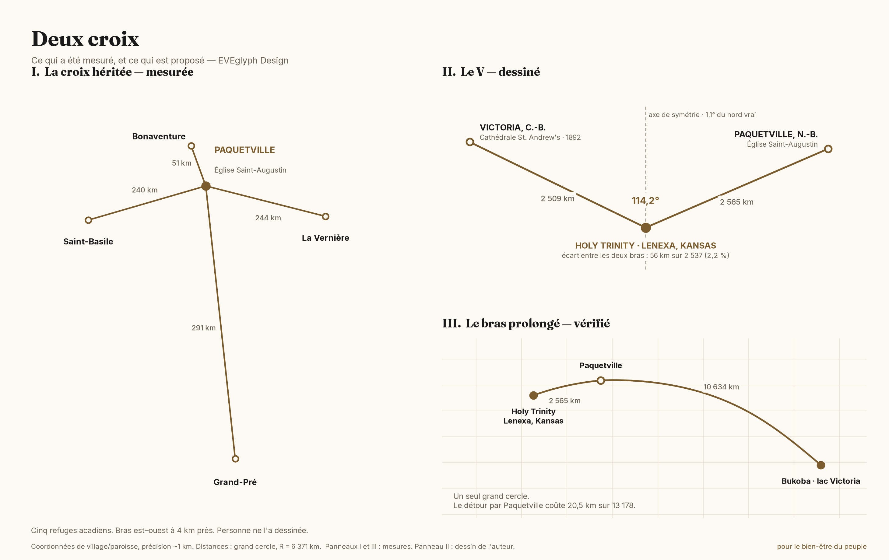

# La lignée / The Line

**Poitou → Port-Royal → Grand-Pré → l'exil → la Louisiane → Sainte-Anne-des-Pays-Bas**

> pour le bien-être du peuple

**Version 4 — 25 July 2026.** Supersedes v3 of the same date. Adds *Deux croix / Two Crosses*: the measured cross of the Acadian refuges, and the V drawn from Holy Trinity, Lenexa, between St. Andrew's Cathedral in Victoria, British Columbia and Église Saint-Augustin in Paquetville. See *Corrections* at the end.

---

## Evidence standard

Every dated claim on this page carries one of three marks. Nothing is asserted without one.

| Mark | Meaning |
|---|---|
| **[R]** | **Record.** A surviving primary document says this. |
| **[I]** | **Inference.** Reasoned from records, but no document states it. |
| **[L]** | **Lore.** Family or community tradition. Held with respect, not cited as fact. |
| **[A]** | **Author's reading.** An interpretation by the author of this page. Offered as his own, not as history. |

---

## FR — Ce que nous sommes

Nous ne revendiquons pas la plus ancienne église catholique d'Amérique du Nord. Cette distinction appartient à d'autres, et l'exactitude vaut plus que la grandeur. Ce que nous portons est plus rare : **une lignée dont l'archive acadienne a été détruite par la guerre et la déportation, et dont le seul registre survivant a été emporté à la main d'un continent à l'autre par le peuple lui-même.**

### 1604 · la fondation de l'Acadie — **[R]**
Pierre Du Gua de Monts et Samuel de Champlain débarquent à l'île Sainte-Croix en 1604 ; l'habitation de Port-Royal suit en 1605 ([Canadian-American Center, Université du Maine](https://umaine.edu/canam/champlain-and-the-settlement-of-acadia-1604-1607/)). **Aucune famille acadienne n'était de ce voyage.** C'est la date de l'Acadie, non celle des familles.

### 1613 · la paroisse Saint-Jean-Baptiste de Port-Royal — **[R]**
La première paroisse acadienne est fondée à Port-Royal sous le nom de Saint-Jean-Baptiste ([Sentier Acadie historique](https://sentieracadie.ca/fr/ancetres-acadiens/registres)). C'est la paroisse qui date de 1613 — non la famille.

### 1636-1650 · l'arrivée des Terriot en Acadie — **[I]**
Jehan Terriau naît en 1601 à Martaizé, en Poitou ([Bona Arsenault, via la Société de la famille acadienne Terriot](https://terriau.org/arsenaul.htm)). Geneviève Massignon, ayant dépouillé les registres paroissiaux de La Chaussée près du village d'Aulnay, relève **le nom Terriot parmi ceux figurant aux recensements de la seigneurie de la mère de Charles de Menou d'Aulnay** — la même seigneurie d'où d'Aulnay recruta ses colons.

Les Terriot **ne figurent pas** au rôle du *Saint-Jehan* de 1636, seule liste de passagers de l'époque à avoir survécu ; trois de ses noms seulement reparaissent au recensement de 1671 : Pierre Martin, Guillaume Trahan, Isaac Pesselin ([Acadian Genealogy](https://www.acadian.org/history/acadian-historical-timeline/)). Aucun navire, aucune date. Stephen A. White, l'autorité en la matière, ne va pas au-delà de « avant 1650 ».

### 1671 · le recensement de Port-Royal — **[R]**
Le premier document qui atteste la famille en Amérique du Nord. Dressé par le cordelier Laurent Molins :

> « Laboureur — JEHAN TERRIAU aagé de soixante et dix ans, sa femme Perrine Rau aagée de soixante ans. Leurs enfans sept. »

Claude 34, Jehan 32, Bonaventure 30, Jeanne 27, Germain 25, Catherine 21, Pierre 16 — six bêtes à cornes, une brebis, cinq arpents de terre labourable ([transcription du recensement de 1671](https://www.wikitree.com/wiki/Th%C3%A9riot-99)).

**Le recensement donne les âges. Il ne donne pas les lieux de naissance.** Toute généalogie affirmant que Claude est né à Port-Royal en 1637 le déduit ; aucun document ne le dit.

### v. 1680 · Grand-Pré — **[R]**
Pierre Terriot, fils de Jehan, fonde Grand-Pré avec Pierre Melanson. Melanson fonde la paroisse de Saint-Charles-des-Mines ; **Pierre Terriot fonde celle de Saint-Joseph de la rivière aux Canards** ([Grand-Pré, Nouvelle-Écosse](https://en.wikipedia.org/wiki/Grand-Pr%C3%A9,_Nova_Scotia)). Un Terriot n'a pas seulement habité la paroisse — il l'a fondée.

### 5 septembre 1755 · l'église de Saint-Charles-des-Mines — **[R]**
Winslow établit ses quartiers dans le presbytère et l'église, y convoque 418 hommes acadiens et les fait prisonniers dans le lieu saint même. Au moins une demi-douzaine de familles Thériault sont déportées.

### 1755-1767 · le registre voyage — **[R]**
Les registres de Saint-Charles-des-Mines sont sauvés par les Acadiens, emportés au Maryland, puis en Louisiane, et remis en 1767 au prêtre résident du fort San Gabriel ([Chemins de la francophonie](https://acadie.cheminsdelafrancophonie.org/en/st-gabriel/)). Les registres de 1707 à 1748 — 3 412 inscriptions — sont aujourd'hui dans les voûtes du diocèse de Baton Rouge.

### automne 1755 · Sainte-Anne-des-Pays-Bas — **[R]**
Les réfugiés remontent la rivière Saint-Jean jusqu'à Sainte-Anne. Fondateur du design de la paroisse : Donat Omer Thériault.

### Les deux Acadies — **[R]**

Il y eut deux Acadies. Celle des seigneurs, qui se disputaient les revenus de la fourrure et du bois, et qui pouvaient rentrer en France. Celle des habitants, qui endiguaient les marais et qui ne le pouvaient pas.

Le recensement de 1671 dit lequel des deux nous étions. Le premier mot inscrit devant le nom de Jehan Terriau n'est ni sieur ni officier : **« Laboureur »**.

---

## EN — What we are

We do not claim the oldest Roman Catholic site in North America. **That claim is not ours and would not survive scrutiny** — the oldest continuously operating Catholic parish in the United States is St. Augustine, Florida (1565), and the oldest standing Catholic church structure is San Miguel Chapel in Santa Fe, built about 1610 ([Yahoo News](https://www.yahoo.com/news/oldest-church-newest-technology-santa-030100199.html)). Making a claim we cannot defend would cost us the credibility of everything else on this page.

What we hold is rarer than an age record.

### The Church kept the registers. They were destroyed.

This must be said plainly, because the reasonable assumption is the opposite.

The Catholic Church did keep baptismal, marriage and burial registers at Port-Royal from the parish's founding in 1613. The Capuchins ran the mission from 1632. Those books existed.

**Only two Port-Royal registers survive: 1702–1728 and 1727–1755.** They are the only pre-Deportation Acadian parish registers still held in Nova Scotia, now at the Centre acadien of Université Sainte-Anne and published by the [Nova Scotia Archives](https://archives.novascotia.ca/acadian/background/). Everything before 1702 is gone — the entire first ninety years, including every Terriot baptism, marriage and burial from the arrival through the 1671 census.

Stephen A. White states it without qualification: no registers survive at all for Cobequid, the two churches at Pisiguid, Rivière aux Canards, Chipody, or any of the lesser missions of old Acadie ([White, via Acadian-Cajun Genealogy](https://freepages.rootsweb.com/~acadiancajun/genealogy/religion.htm)).

The cause was not neglect. It was the removal of the custodians. Robert Sedgwick's New England force seized Port-Royal in 1654; the English then killed Léonard de Chartres, the Capuchin superior in Acadia, and expelled his confrères in violation of the terms of capitulation ([Binasco, *The Troubled Activity of the Roman Catholic Missionaries in Acadia*, Saint Mary's University](https://www.smu.ca/webfiles/binasco-catholicmissionariesinacadia-2007.pdf)). A century later the Deportation finished what the raid began.

### Rome does not hold baptisms

Rome holds governance, not sacraments. Baptismal registers are parish records, kept at the parish and copied to the diocese. What the Holy See holds for a mission territory such as Acadie is Propaganda Fide correspondence — reports, appointments, disputes. There is no central register of baptisms in Rome, and there never was.

Our own case makes the point sharply. Between 1668 and 1674 the Cordelier Laurent Molins served the parish of Port-Royal without the assent of either the Propaganda or the French court, **and so there are no documents concerning him in those archives** (Binasco, above). Molins is the priest who conducted the 1671 census. The single surviving document that proves our family stood at Port-Royal was made by a man Rome had no record of.

### Where the record still exists: Poitou

The Acadian archive of this family was destroyed. The French one was not.

Massignon established the Terriot connection by reading the surviving parish registers of **La Chaussée**, beside the village of Aulnay, and Arsenault places Jean Terriau's birth at **Martaizé** in 1601 *"sans aucun doute"* — the phrasing of someone working from a register entry. Both parishes are in the Vienne, and the Archives départementales de la Vienne have digitised their registres paroissiaux.

**Open lead:** locate and cite the Martaizé baptism entry directly. If it is found, the family gains a primary record older than anything surviving in North America.

### The three churches

**Grand-Pré, Nova Scotia — the origin.** Saint-Charles-des-Mines stood until 1755. The Memorial Church built by Acadians in 1922 stands near the original site. The Landscape of Grand-Pré was inscribed as a UNESCO World Heritage Site in 2012 as "the main place of remembrance" of the Acadian people ([UNESCO](https://whc.unesco.org/document/152586)). Parks Canada records it as the heart of the ancestral homeland, from which some 2,200 men, women and children were deported ([Parks Canada](https://parks.canada.ca/lhn-nhs/ns/grandpre/culture/histoire-history)).

**St. Martin de Tours, St. Martinville, Louisiana — the mother church.** Founded 1765 by Acadian exiles arriving in the Attakapas district, first called *l'Église de la Nouvelle Acadie* ([St. Martin de Tours](https://saintmartindetours.org/full-history)). Recognised as the **Mother Church of the Acadians** and listed on the National Register of Historic Places in 1972. A Mass in French is still offered every 28 July.

**Old St. Gabriel Church, Iberville Parish, Louisiana — the oldest standing.** Parish established 1769 by Acadian exiles sent to the Iberville coast; the cypress building was begun in 1774 and completed in 1776. The Diocese of Baton Rouge records it as **the oldest surviving church structure in the Mississippi River Valley** ([Diocese of Baton Rouge](https://diobr.org/st-gabriel-the-archangel-st-gabriel)). The Library of Congress documents it as built circa 1769 by Acadian immigrants from the vicinity of Les Mines in Nova Scotia ([Library of Congress HABS](https://www.loc.gov/pictures/item/la0339/)). Its 1768 bell still rings.

### The claim that is actually ours

**The Church's Acadian record of this family was destroyed by an act of war and then by a deportation. The one register that survived, survived because the people carried it out themselves.**

The Saint-Charles-des-Mines books went to Maryland, then to the Mississippi, and were handed to a priest at Fort San Gabriel in 1767. They sat in that church for over a century before going to the diocesan archive in Baton Rouge, where they remain ([The Globe and Mail](https://www.theglobeandmail.com/politics/article-acadians-immigration-citizenship-unfair-treatment-historians-say/)).

That is not a monument. That is a **records-continuity operation carried out by a dispossessed people under duress, and it worked.**

### The Two Acadies

There were two Acadies. The seigneurs, who fought each other over fur and timber revenue and who could go back to France. The habitants, who diked the marshes and could not.

The 1671 census says which one we were. The first word entered against Jehan Terriau's name is not *sieur* and not *officier*. It is **Laboureur** — ploughman. Six cattle, one sheep, five arpents ([1671 Port-Royal census](https://www.wikitree.com/wiki/Th%C3%A9riot-99)).

**1645 · Fort La Tour — [R].** Charles de Menou d'Aulnay and Charles de Saint-Étienne de La Tour had been ordered by the French court to share the colony's revenue. Instead they made war on each other for a decade ([Historical Marker Database](https://www.hmdb.org/m.asp?m=141988)). In April 1645 d'Aulnay besieged Fort La Tour and offered quarter to the garrison if Françoise-Marie Jacquelin would surrender it. She did. He then reneged and hanged the garrison, sparing one man on condition that he hang the others, and made her watch with a rope around her own neck. She was dead within three weeks. Parks Canada records that he "reneged on the conditions of surrender and executed the members of the garrison" ([Parks Canada, Fort La Tour NHS](https://www.pc.gc.ca/apps/dfhd/page_nhs_eng.aspx?id=201)). The contemporary account is that of Nicolas Denys, who was in the colony at the time.

Breaking quarter was a violation of the laws of war by the standards of d'Aulnay's own century. This is not a judgement applied in hindsight.

**1650-1654 · the succession — [R].** D'Aulnay drowned in 1650 owing roughly 260,000 livres, chiefly to his creditor Emmanuel Le Borgne. In 1653 La Tour married d'Aulnay's widow, Jeanne Motin, merging the two houses; Le Borgne then pursued the estate against La Tour and Nicolas Denys ([Guerre civile acadienne](https://fr.wikipedia.org/wiki/Guerre_civile_acadienne)). That quarrel was still running when Robert Sedgwick's English force arrived in July 1654 and took the colony. Le Borgne signed the capitulation of Port-Royal on 16 August, and asked for his ship and merchandise back.

The war that hanged a garrison was settled by a property marriage. The colony fell while its lords were litigating a dead man's balance sheet. Nobody who was hanged was un-hanged by the settlement.

**1713 · Utrecht — [R].** France ceded mainland Acadia to Britain and kept Île Royale, where it began building Louisbourg, which became the most expensive military installation in North America ([Peace of Utrecht](https://en.wikipedia.org/wiki/Peace_of_Utrecht)). The Acadians, in the great majority, stayed on their land under British rule ([Centre d'études acadiennes, Université de Moncton](http://cfml.ci.umoncton.ca/cea/documts/notices/htm.cfm?ret=ed3&ident=T0065)). The Crown kept the fortress and the fishery and let go of the people.

**1730-1755 · the Neutrals — [R].** The Acadians signed a conditional oath of allegiance carrying an exemption from bearing arms, attested by the priest Charles de la Goudalie and the notary Alexandre Bourg. They were thereafter known as the **French Neutrals**. Naomi Griffiths describes the span that followed as a golden age, with family sizes and life expectancy exceeding those of France, Canada and New England ([BCcampus, *Canadian History: Pre-Confederation*](https://opentextbc.ca/preconfederation/chapter/6-10-acadia-1713-1755/)).

A people with no army and no lord, refusing both empires, outlived the subjects of both. Then were deported.

> **[A] — the author's reading, offered as his own and not as history.**
>
> These are two worlds, not two factions. The Old World is where people harm each other and themselves to get things that do not matter, and where the ones at the top can always go home. The New World is where people strive to be better, and one day reach peace. Acadie held both at once. The seigneurs went back to France. We stayed, and were named for the pastoral paradise, and refused to take up arms against anyone — against the English, against the Mi'kmaq, against anyone — and we were deported for it anyway.
>
> I take the habitant side. That is a choice about which world to build in, not a claim about what the documents say. The documents are above. — *Dany Theriault*

### Why this is on a technology page

Because it is the same problem.

The institution holding the record was not able to protect it. The custodians were removed by force. The land, the buildings, and the archive were seized together — and the only thing that survived was the copy the community itself carried out and kept.

Three centuries later, the record lives on someone else's platform, the terms are written by the holder, and most people do not know what is held about them or how to get it back. We build export tools, sovereign archives, and parish-owned systems for one reason: **the family that carried the register out of Grand-Pré already proved what happens to a people who do not hold their own records, and what it costs to get them back.**

We are not theorising about data sovereignty. We are continuing a practice.

---

## Deux croix / Two Crosses

---

## FR — Deux croix

### I · La croix héritée — **[R]**

Cinq églises. Aucune n'a été placée par un plan : chacune marque l'endroit où un groupe d'Acadiens s'est arrêté et a bâti. Mesurées depuis l'église Saint-Augustin de Paquetville (47,6689 N ; 65,0992 O) :

| Église | Distance | Azimut |
|---|---|---|
| Église de Saint-Bonaventure, Gaspésie — tête | 51,2 km | 325,1° |
| Église Saint-Basile, Madawaska — bras ouest | 240,0 km | 262,6° |
| Église Saint-Pierre-de-La Vernière, Îles-de-la-Madeleine — bras est | 244,0 km | 96,3° |
| Église-souvenir de Grand-Pré — pied | 291,1 km | 167,7° |

Les deux bras diffèrent de **4 km sur 240**. La traverse Saint-Basile ↔ La Vernière porte 87,2°, soit à 3° de l'est vrai ; Paquetville se tient à 28,8 km de cette ligne. Le montant Bonaventure → Grand-Pré porte 164,1° ; Paquetville en est à 16,9 km. Proportions de croix latine : tête courte, bras égaux, pied long, l'ensemble incliné d'environ 16° à l'est du sud vrai.

**Ce que chaque point est — [R].** Bonaventure : fondée en 1760 par des exilés de Beaubassin, Grand-Pré et Port-Royal ; 92 Acadiens y sont réfugiés entre 1760 et 1763 après Ristigouche ([Patrimoine culturel du Québec](https://www.patrimoine-culturel.gouv.qc.ca/rpcq/detail.do?methode=consulter&id=93374&type=bien), [UQTR](https://depot-e.uqtr.ca/id/eprint/8497/1/032072632.pdf)). Saint-Basile : paroisse érigée le 12 novembre 1792, berceau du Madawaska, fondée par des Acadiens remontés depuis Sainte-Anne-des-Pays-Bas ([Diocèse d'Edmundston](https://www.diocese-edmundston.ca/fr/zp_st-basile.html)) ; 31 croix y honorent les familles fondatrices depuis le 9 août 1961 ([Acadiensis](https://www.erudit.org/fr/revues/acadiensis/2016-v45-n2-acad_45_2/acad45_2rn03/)). La Vernière : environ 250 Acadiens réfugiés à Saint-Pierre-et-Miquelon gagnent les Îles sous l'abbé Jean-Baptiste Allain au début des années 1790 ([Musée acadien du Québec](https://museeacadien.com/iles-de-la-madeleine/)) ; église de 1872-1881, classée le 13 mars 1992 ([Lieux patrimoniaux](https://www.historicplaces.ca/fr/rep-reg/place-lieu.aspx?id=11999&pid=0)). Grand-Pré : église-souvenir bâtie en 1922 avec des fonds levés auprès des Acadiens de toute l'Amérique du Nord ([Parcs Canada](https://parcs.canada.ca/lhn-nhs/ns/grandpre/culture/eglise-church)). Paquetville : desservie en mission de 1873 à 1886, premier curé résident en 1886, église de pierre en 1920 ([CEAAC, Université de Moncton](https://www.umoncton.ca/umcm-ceaac/files/umcm-ceaac/wf/wf/pdf4/f1582-1archreli.pdf)).

### II · Ce qui n'est pas sur la croix — **[R]**

Saint-Martin-de-Tours à St. Martinville, en Louisiane — l'église-mère des Acadiens, fondée en 1765 ([saintmartindetours.org](https://saintmartindetours.org/about-us)) — se trouve à 2 999,2 km de Paquetville, azimut 239,1°. Elle manque le montant prolongé de **2 868,2 km**. La Louisiane n'est pas sur cette croix. Le dire est une correction, pas un jugement : la déportation a dispersé au-delà de toute figure.

### III · Le V — **[A] dessin de l'auteur**

Ceci n'est pas une découverte. C'est un tracé. Centre : Holy Trinity, Lenexa, Kansas.

| Bras | Distance | Azimut |
|---|---|---|
| Cathédrale St. Andrew's, Victoria, Colombie-Britannique | 2 508,6 km | 304,1° |
| Église Saint-Augustin, Paquetville, Nouveau-Brunswick | 2 564,6 km | 58,2° |

Ce qui est **mesuré** : les deux bras diffèrent de **55,9 km sur une moyenne de 2 537 km — 2,2 %**. L'angle qu'ils ouvrent est de **114,2°**. Sa bissectrice porte **1,14° du nord vrai**. La figure est donc symétrique autour du méridien, à un degré près.

Ce qui est **choisi** : les deux extrémités. Personne ne les a placées pour former cette figure.

**Pourquoi ces deux-là — [R] sur les faits, [A] sur la lecture.** St. Andrew's a été dessinée par les architectes montréalais Maurice Perrault et Albert Mesnard, d'après les plans d'une église paroissiale québécoise ; la soumission retenue fut celle d'Aeneas McDonald, 81 052 $ ; l'évêque Jean-Nicolas Lemmens l'a bénie le 30 octobre 1892 ([St. Andrew's Cathedral](https://www.standrewscathedral.com/history-of-the-cathedral), [thejesusquestion, notice historique](https://thejesusquestion.org/wp-content/uploads/2013/04/st-andrews-cathedral-art-victoria-bc.pdf)). Elle est lieu historique national depuis 1990 ([Parcs Canada](https://www.pc.gc.ca/apps/dfhd/page_nhs_eng.aspx?id=104)). Dans la crypte repose Mgr Modeste Demers, né à Saint-Nicolas-de-Lévis en 1809, sacré premier évêque de l'île de Vancouver le 30 novembre 1847, mort à Victoria en 1871 — architecte, arpenteur, charpentier, maçon, orfèvre, imprimeur et éditeur de son propre aveu ([Dictionnaire biographique du Canada](http://www.biographi.ca/fr/bio/demers_modeste_10E.html), [CCHA 1953](https://cchahistory.ca/journal/CCHA1953/Hill.pdf)). L'autel actuel a été taillé par l'artiste salish du littoral Charles Elliott, le lutrin par Roy Henry Vickers ([St. Andrew's Cathedral](https://standrewscathedral.com/about.html)).

Un plan québécois, une soumission portée par un nom des îles, des mains salish à l'autel. Trois traditions dans un seul bâtiment, sur la côte ouest. **[A]** C'est cela que je place au bout du bras ouest : non pas une conquête, un chantier partagé.

### IV · Le bras prolongé — **[R]**

Le bras est, continué au-delà de Paquetville, ne s'arrête pas.

- Holy Trinity → Paquetville : 2 564,6 km
- Paquetville → Bukoba, sur le lac Victoria : 10 634,2 km
- **Somme : 13 198,7 km. Ligne directe Holy Trinity → Bukoba : 13 178,2 km.**
- Écart : **20,5 km sur 13 178 — 0,156 %.**

Les trois points tiennent sur un même grand cercle. Paquetville est à 340 km de la ligne directe, sur une portée de plus de treize mille kilomètres.

Aux deux extrémités de cette portée, un même nom écrit deux fois : Victoria en Colombie-Britannique, et le lac Victoria en Afrique de l'Est — les deux nommés d'après la même reine. **[R]** pour le nom. **[A]** pour ce que j'en fais.

### V · Ce qui n'est pas démontré — **[R]**

Je le pose avant qu'on me le reproche.

1. Le V **n'est pas une croix**. 114,2°, pas 180°. Je ne prétends pas le contraire.
2. Holy Trinity **n'est pas sur la ligne** Victoria–Paquetville : elle en est à 1 431 km, soit 33,9 % de la portée. Ce n'est pas un point d'une droite, c'est le sommet d'un angle.
3. Bukoba est **choisie, non vécue**. Je n'y suis jamais allé. Aucune expérience familiale ne l'appuie. Elle entre ici comme intention, pas comme mémoire.
4. Les coordonnées sont celles des villages et des paroisses, à environ 1 km près. Ce ne sont pas des portes d'église relevées au théodolite. Les distances sont des grands cercles, R = 6 371 km.

### VI · Pourquoi je trace ceci — **[A]**

La première croix, je ne l'ai pas faite. Elle est le dessin qu'ont laissé des gens qui fuyaient et qui, chaque fois qu'ils s'arrêtaient, bâtissaient une église avant de bâtir autre chose. Elle est exacte à quatre kilomètres près et personne ne l'a voulue. C'est l'Ancien Monde qui l'a imposée par la déportation, et le Nouveau qui l'a refermée par la construction.

La seconde, je la trace. Deux bras égaux depuis la paroisse où je me tiens aujourd'hui : à l'ouest les bâtisseurs, à l'est le village fondateur. Un V, pas une croix — et le V est le signe. Victoria, victoire, **PAIX** : le même mot dit trois fois. La victoire n'est pas une conquête ; c'est le moment où des gens choisissent la paix librement, sans représailles.

Ma mère venait du côté des maîtres artisans. Mon père du côté de l'administration et de l'intendance. Deux mondes qui se sont rencontrés et qui en ont fait un troisième. Je ne suis pas le premier à porter cette figure, je suis celui à qui elle est échue. Et si ma fille Ève se tient un jour au sommet de cet angle et rejoint la côte ouest au village fondateur, ce n'est pas moi qui aurai fermé la ligne.

Je le livre dans un jeu pour enfants. C'est délibéré. Ce qu'on veut voir tenir trois cents ans, on ne le met pas dans un contrat.

---

## EN — Two Crosses

### I · The inherited cross — **[R]**

Five churches, none of them sited by any plan. Each marks where a group of Acadians stopped and built. Measured from Église Saint-Augustin, Paquetville: Bonaventure 51.2 km at 325.1° (head), Saint-Basile 240.0 km at 262.6° (west arm), La Vernière 244.0 km at 96.3° (east arm), Grand-Pré 291.1 km at 167.7° (foot).

The two arms differ by **4 km in 240**. The crossbar bears 87.2° — within 3° of true east — and Paquetville sits 28.8 km off it. The upright bears 164.1°; Paquetville sits 16.9 km off it. Latin-cross proportions, leaning about 16° east of true south. Nobody designed this. Refuge did.

### II · What is not on it — **[R]**

St. Martin of Tours, St. Martinville, Louisiana — Mother Church of the Acadians, founded 1765 — lies 2,999.2 km from Paquetville at 239.1°, and misses the extended upright by **2,868.2 km**. Louisiana is not on this cross. Saying so is a correction, not a verdict. The deportation scattered people past the reach of any figure.

### III · The V — **[A] the author's drawing**

Not a discovery. A drawing. Centre: Holy Trinity, Lenexa, Kansas.

- **St. Andrew's Cathedral, Victoria, British Columbia** — 2,508.6 km at 304.1°
- **Église Saint-Augustin, Paquetville, New Brunswick** — 2,564.6 km at 58.2°

**Measured:** the arms differ by **55.9 km against a mean of 2,537 km — 2.2%**. The included angle is **114.2°**. Its bisector runs **1.14° off true north**, so the figure is symmetric about the meridian to within a degree.

**Chosen:** the two endpoints. No one placed them to make this shape.

St. Andrew's was drawn by Montreal architects Maurice Perrault and Albert Mesnard from a Quebec parish plan, built on the winning tender of Aeneas McDonald at $81,052, and blessed by Bishop Jean-Nicolas Lemmens on 30 October 1892; National Historic Site since 1990. In the crypt lies Bishop Modeste Demers — first Bishop of Vancouver Island, consecrated 30 November 1847, died Victoria 1871 — recorded as architect, surveyor, carpenter, mason, silversmith, printer and editor. The present altar was carved by Coast Salish artist Charles Elliott, the lectern by Roy Henry Vickers. A Quebec drawing, an islander's contract, Salish hands at the altar. **[A]** That is what I put at the end of the west arm: not a conquest, a shared worksite.

### IV · The arm extended — **[R]**

Holy Trinity → Paquetville, 2,564.6 km. Paquetville → Bukoba on Lake Victoria, 10,634.2 km. Sum 13,198.7 km against a direct line of 13,178.2 km — an excess of **20.5 km in 13,178, or 0.156%**. The three points sit on one great circle; Paquetville is 340 km off the direct line across a reach of more than thirteen thousand kilometres.

At either end of that reach, the same name written twice: Victoria in British Columbia, Lake Victoria in East Africa, both named for the same queen. **[R]** for the name. **[A]** for what I make of it.

### V · What is not proven — **[R]**

1. The V **is not a cross**. 114.2°, not 180°.
2. Holy Trinity **is not on the line** between Victoria and Paquetville. It is 1,431 km off it — 33.9% of the span. It is the apex of an angle, not a point on a straight line.
3. Bukoba is **chosen, not lived**. I have never been to Tanzania. No family experience supports it. It enters as intent, not as memory.
4. Coordinates are village and parish points, good to about 1 km — not surveyed church doors. Distances are great-circle, R = 6,371 km.

### VI · Why I draw this — **[A]**

The first cross I did not make. It is the figure left by people who ran, and who each time they stopped built a church before they built anything else. It is accurate to four kilometres and nobody intended it. The Old World imposed it by deportation; the New World closed it by building.

The second I draw. Two equal arms from the parish where I stand today: the builders to the west, the founding village to the east. A V, not a cross — and the V is the sign. Victoria, victory, **PAIX**: the same word said three times. Victory is not conquest. It is the moment people choose peace freely, with no retribution.

My mother's side were master craftsmen. My father's side were stewards and administrators. Two worlds met and made a third. I am not the first to carry this figure; I am the one it fell to. And if my daughter Eve one day stands at the apex of that angle and joins the west coast to the founding village, it will not have been me who closed the line.

I am delivering it in a children's game. That is deliberate. What you want to last three hundred years, you do not put in a contract.

---

## Corrections

**v1 → v2, 25 July 2026.**

1. **Arrival date.** v1 said the family arrived circa 1637, reasoning that Claude Terriot was 34 in the 1671 census and therefore born at Port-Royal in 1637. The census records ages, not birthplaces. The birthplace was assumed. Corrected to 1636–1650, the range the evidence supports.
2. **1604 and 1613.** Both are real dates that belong to Acadie and to the parish of Saint-Jean-Baptiste respectively, not to the family. Added as records in their own right so the confusion does not recur.
3. **Saint-Jehan.** Recorded explicitly that the Terriots are not on the 1636 manifest, so no future draft claims it.
4. **Church registers.** Added. The absence of a pre-1702 record is not an absence of Church record-keeping; it is the destruction of one.
5. **Rome.** Added, with the Molins case.

**v2 → v3, 25 July 2026.**

6. **The Two Acadies added.** The seigneurial class and the habitant class, with the 1645 Fort La Tour siege, the Le Borgne succession and the 1654 fall, the 1713 ledger at Utrecht, and the 1730-1755 neutrality, each marked **[R]** and sourced.
7. **New marker [A] introduced.** The Old World / New World framing is the author's interpretation. It is set apart in a quoted block, signed, and explicitly not presented as history. Earlier drafts risked letting interpretation sit unmarked beside record.
8. **One claim declined.** It is sometimes said in the family that d'Aulnay's class sold the Acadians to the English. D'Aulnay died in 1650, one hundred and five years before the Deportation, and no document supports a sale. What the record does support is abandonment: a succession quarrel that left the colony undefended in 1654, and a treaty in 1713 that kept the fortress and let go of the people. The stronger claim is the documented one.

**v3 → v4, 25 July 2026.**

9. **Two Crosses added.** Both figures are given with their measurements and both are marked. The Acadian refuge cross is **[R]** — computed from published parish and heritage records, not designed by anyone. The V from Holy Trinity is **[A]** — the author's drawing, with only two facts about it marked **[R]**: that the arms are equal to 2.2 % and that the bisector runs 1.14 degrees off true north.
10. **Louisiana shown to be off the cross.** St. Martinville misses the extended upright by 2 868.2 km. An earlier working draft had assumed the Louisiana church belonged to the figure. It does not. It is recorded here so the assumption does not return.
11. **Victoria disambiguated.** Two different places carry the name in this work. **Victoria, British Columbia** is the west arm of the V, chosen for St. Andrew's Cathedral and the builders' record attached to it. **Lake Victoria / Bukoba, Tanzania** is not an arm; it is the eastern arm continued, and it is marked as intent rather than memory because the author has never been there.
12. **One claim declined.** An earlier draft proposed a four-armed cross centred on Holy Trinity. It does not exist. Victoria and Paquetville stand 114.2° apart, not 180°, and Holy Trinity lies 1 431 km off the great circle joining them. The figure is an angle, and it is published as an angle.
13. **Bishop Demers' trades.** Listed as recorded by the Canadian Catholic Historical Association in 1953 — architect, surveyor, carpenter, mason, silversmith, printer, editor. Included because it is documented, not because it is convenient.

Anyone may challenge a claim on this page. A claim that cannot be marked **[R]** or defended as **[I]** comes off it. A claim marked **[A]** is one man's reading and is labelled as such.

---

## Sources

[Canadian-American Center, University of Maine — Champlain and the Settlement of Acadia 1604-1607](https://umaine.edu/canam/champlain-and-the-settlement-of-acadia-1604-1607/) · [Sentier Acadie historique — Registres](https://sentieracadie.ca/fr/ancetres-acadiens/registres) · [Nova Scotia Archives — An Acadian Parish Remembered: the Registers of St. Jean-Baptiste, Annapolis Royal, 1702-1755](https://archives.novascotia.ca/acadian/background/) · [Centre acadien, Université Sainte-Anne — Registres de Saint-Jean-Baptiste de Port-Royal](https://www.usainteanne.ca/centre-acadien/a-consulter-en-ligne/registres-de-saint-jean-baptiste-de-port-royal) · [Matteo Binasco, The Troubled Activity of the Roman Catholic Missionaries in Acadia, Saint Mary's University](https://www.smu.ca/webfiles/binasco-catholicmissionariesinacadia-2007.pdf) · [Stephen A. White on surviving registers, via Acadian-Cajun Genealogy](https://freepages.rootsweb.com/~acadiancajun/genealogy/religion.htm) · [Bona Arsenault account, Terriot Acadian Family](https://terriau.org/arsenaul.htm) · [Acadian Historical Timeline — the Saint-Jehan, 1636](https://www.acadian.org/history/acadian-historical-timeline/) · [1671 Port-Royal census transcription](https://www.wikitree.com/wiki/Th%C3%A9riot-99) · [Parks Canada — History of Grand-Pré](https://parks.canada.ca/lhn-nhs/ns/grandpre/culture/histoire-history) · [UNESCO WHC — Landscape of Grand Pré, ID 1404](https://whc.unesco.org/en/list/1404/) · [Diocese of Baton Rouge — St. Gabriel the Archangel](https://diobr.org/st-gabriel-the-archangel-st-gabriel) · [Library of Congress HABS — Old St. Gabriel Church](https://www.loc.gov/pictures/item/la0339/) · [St. Martin de Tours — parish history](https://saintmartindetours.org/full-history) · [Chemins de la francophonie — St. Gabriel](https://acadie.cheminsdelafrancophonie.org/en/st-gabriel/) · [Parks Canada — Fort La Tour National Historic Site](https://www.pc.gc.ca/apps/dfhd/page_nhs_eng.aspx?id=201) · [Guerre civile acadienne](https://fr.wikipedia.org/wiki/Guerre_civile_acadienne) · [Historical Marker Database — La Tour and d'Aulnay](https://www.hmdb.org/m.asp?m=141988) · [Peace of Utrecht](https://en.wikipedia.org/wiki/Peace_of_Utrecht) · [Centre d'études acadiennes, Université de Moncton](http://cfml.ci.umoncton.ca/cea/documts/notices/htm.cfm?ret=ed3&ident=T0065) · [BCcampus — Canadian History: Pre-Confederation, Acadia 1713-1755](https://opentextbc.ca/preconfederation/chapter/6-10-acadia-1713-1755/) · [Église de Saint-Bonaventure — Patrimoine culturel du Québec](https://www.patrimoine-culturel.gouv.qc.ca/rpcq/detail.do?methode=consulter&id=93374&type=bien) · [Diocèse d'Edmundston — Saint-Basile](https://www.diocese-edmundston.ca/fr/zp_st-basile.html) · [Acadiensis — les 31 croix de Saint-Basile](https://www.erudit.org/fr/revues/acadiensis/2016-v45-n2-acad_45_2/acad45_2rn03/) · [Musée acadien du Québec — Îles-de-la-Madeleine](https://museeacadien.com/iles-de-la-madeleine/) · [Lieux patrimoniaux — Église Saint-Pierre-de-La Vernière](https://www.historicplaces.ca/fr/rep-reg/place-lieu.aspx?id=11999&pid=0) · [Parcs Canada — l'Église-souvenir de Grand-Pré](https://parcs.canada.ca/lhn-nhs/ns/grandpre/culture/eglise-church) · [CEAAC, Université de Moncton — archives religieuses](https://www.umoncton.ca/umcm-ceaac/files/umcm-ceaac/wf/wf/pdf4/f1582-1archreli.pdf) · [UQTR — les Acadiens réfugiés en Gaspésie](https://depot-e.uqtr.ca/id/eprint/8497/1/032072632.pdf) · [St. Martin de Tours — about](https://saintmartindetours.org/about-us) · [St. Andrew's Cathedral, Victoria — history](https://www.standrewscathedral.com/history-of-the-cathedral) · [St. Andrew's Cathedral — history, altar and windows](https://thejesusquestion.org/wp-content/uploads/2013/04/st-andrews-cathedral-art-victoria-bc.pdf) · [Parks Canada — St. Andrew's Roman Catholic Cathedral National Historic Site](https://www.pc.gc.ca/apps/dfhd/page_nhs_eng.aspx?id=104) · [HistoricPlaces.ca — St. Andrew's Cathedral](https://www.historicplaces.ca/en/rep-reg/place-lieu.aspx?id=1472) · [Dictionnaire biographique du Canada — Modeste Demers](http://www.biographi.ca/fr/bio/demers_modeste_10E.html) · [CCHA 1953 — The Most Reverend Modeste Demers, First Bishop of Vancouver Island](https://cchahistory.ca/journal/CCHA1953/Hill.pdf) · [Diocese of Victoria in Canada](https://en.wikipedia.org/wiki/Diocese_of_Victoria_in_Canada)

---

© 2026 Dany Theriault. EVE "digital stem cell" glyph and glyph-based design principles — all rights reserved. Stewardship of rights of use and assignment for large public and institutional usage rests with the Pacific Utilities Design Council. Published as a time-stamped record of authorship and intent.
